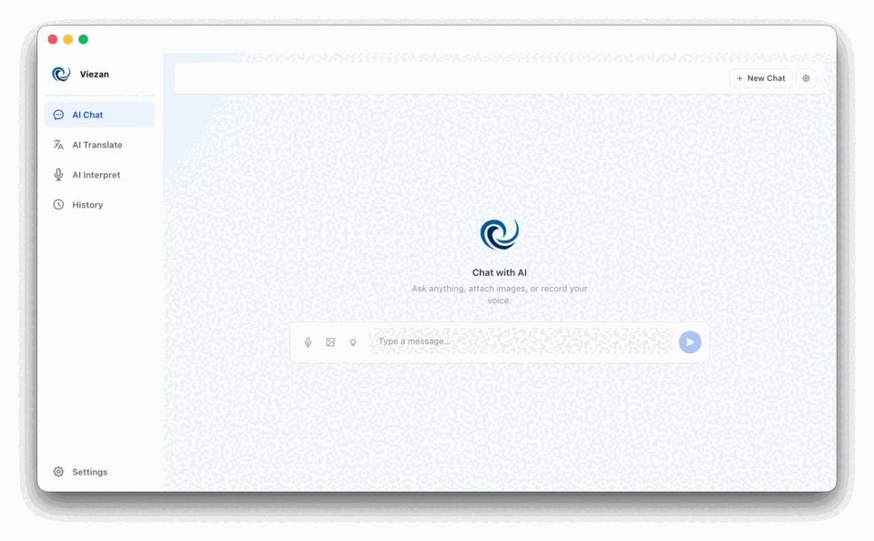

<p align="right">
  <a href="https://me.momo.vn/aMI2T6tWf3uRteU4tqUZtn">
    
  </a>
</p>

# Viezan — AI Translation Desktop App

<p align="center">
  
</p>

<p align="center">
  A powerful AI translation desktop app running 100% locally on <strong>macOS</strong>, <strong>Windows</strong> and <strong>Linux</strong>.<br>
  Supports <strong>Google Gemini</strong>, <strong>Anthropic Claude</strong> and <strong>OpenAI GPT</strong> — API keys stored securely in OS Keychain, never sent to any intermediate server.
</p>

<p align="center">
  <a href="https://github.com/trunghieupham59/Viezan/releases/latest">
    
  </a>
  
  
  
  
</p>

---

## 📸 Screenshots

<p align="center">
  
</p>

---

## 📦 Download

| Platform | Installer |
|----------|-----------|
|  macOS (Apple Silicon) | [Viezan-1.1.0-arm64.dmg](https://github.com/trunghieupham59/Viezan/releases/download/v1.1.0/Viezan-1.1.0-arm64.dmg) |
|  macOS (Intel x64) | [Viezan-1.1.0-x64.dmg](https://github.com/trunghieupham59/Viezan/releases/download/v1.1.0/Viezan-1.1.0-x64.dmg) |
| ⊞ Windows (x64) | [Viezan-Setup-1.1.0-x64.exe](https://github.com/trunghieupham59/Viezan/releases/download/v1.1.0/Viezan-Setup-1.1.0-x64.exe) |
| 🐧 Linux (x64) | [Viezan-1.1.0-x64.AppImage](https://github.com/trunghieupham59/Viezan/releases/download/v1.1.0/Viezan-1.1.0-x64.AppImage) |

> View all releases: [github.com/trunghieupham59/Viezan/releases](https://github.com/trunghieupham59/Viezan/releases)

---

## ✨ Features

| Feature | Description |
|---------|-------------|
| 🤖 **Multiple AI Providers** | Google Gemini, Anthropic Claude, OpenAI GPT — switch anytime |
| 🔤 **7 Translation Styles** | Neutral, Friendly, Professional, Business, Slack, Polite, Technical — fits every context |
| ⚡ **Live Translation** | Real-time translation & floating subtitles from microphone or system audio, with customizable color/size/opacity |
| 🖼️ **Image Translation (AI Vision)** | Drag & drop or paste an image — AI extracts and translates all text |
| 🎙️ **Voice Input** | Supports Web Speech API and OpenAI Whisper |
| 🔊 **Text-to-Speech** | 6 high-quality OpenAI voices: Alloy, Echo, Fable, Onyx, Nova, Shimmer |
| 💬 **AI Chat** | Full chat with image attachment, voice input, System Prompt with saved presets |
| 🇯🇵 **Japanese Furigana** | Automatically renders furigana on Japanese translation output |
| 📜 **History** | Separate history for Translate, Chat and Live sessions — search & reuse anytime |
| 🌐 **Chrome Extension** | Translate directly in the browser (floating button, popup, right-click menu) |
| 🔖 **Bookmarklet** | Quick translate on any browser without an extension |
| ⌨️ **Global Hotkey** | Activate Viezan from any application |
| 🌍 **19 Languages** | Vietnamese, English, Japanese, Korean, Chinese, French, German, Spanish, and more |
| 🌐 **Multi-language UI** | Interface available in Vietnamese, English and Japanese |
| 🔒 **Secure API Key Storage** | Encrypted via Electron safeStorage — Keychain (macOS) / Credential Manager (Windows) |
| 🌙 **Dark Mode** | Follows system appearance automatically |
| 🔄 **Auto Update** | Built-in auto-update |

---

## 🚀 Getting Started

### 1. Download & Install

Download the installer for your platform from the [Download](#-download) section above and run it.

> **macOS:** If you see an "unidentified developer" warning, go to **System Preferences → Security & Privacy** and click **Open Anyway**.

### 2. Add your API Key

1. Open **Viezan**
2. Go to the **Settings** tab
3. Select a provider (Gemini / Claude / OpenAI), paste your API key → **Save Key**

Your key is stored securely in the OS Keychain and never leaves your device.

### 3. Start Translating

- **Translate** — Type or paste text, choose source/target language and style
- **Live** — Real-time translation from microphone/system audio with floating subtitles
- **Image** — Drag & drop or paste an image to extract and translate text
- **Chat** — Chat freely with AI, attach images, voice input and system prompts
- **History** — Revisit all past translations, chats and live sessions

---

## 🔑 API Keys

Get your API keys from the respective dashboards:

| Provider | Dashboard |
|----------|-----------|
| Google Gemini | [aistudio.google.com/apikey](https://aistudio.google.com/apikey) |
| Anthropic Claude | [console.anthropic.com](https://console.anthropic.com) |
| OpenAI GPT | [platform.openai.com/api-keys](https://platform.openai.com/api-keys) |

> API keys are only used in the Electron main process to call the provider API directly — never written to disk, never sent through any intermediate server, never exposed to any third party.

---

## 🌐 Chrome Extension

The Chrome Extension lets you translate directly in the browser without switching windows.

**Installation (Developer / Unpacked):**

1. Open `chrome://extensions` in Chrome
2. Enable **Developer mode**
3. Click **Load unpacked** → select the `chrome-extension/` folder from this repository
4. The Viezan icon will appear in your toolbar

**Connect to the Viezan app:**

1. Open **Viezan** → **Settings → Browser Extension**
2. Copy the **Connection Token**
3. Click the Viezan icon in Chrome → **⚙ Options** → Paste the token → **Save Settings**

> See [chrome-extension/README.md](chrome-extension/README.md) for details.

---

## 🛠️ Development

### Prerequisites

- **Node.js** v18+
- **macOS**, **Windows** or **Linux**

### Setup

```bash
# Clone the repository
git clone https://github.com/trunghieupham59/Viezan.git
cd Viezan

# Install dependencies
npm install

# Start development server + Electron
npm run dev
```

### Test

```bash
npm test              # Run all tests (unit + integration)
npm run test:watch    # Watch mode
npm run test:coverage # Coverage report
```

Tests are located in `src/**/__tests__/` and `electron/ipc/__tests__/`.

### Build

```bash
npm run build:mac     # macOS (arm64 + x64 DMG)
npm run build:win     # Windows (NSIS installer)
npm run build:linux   # Linux (AppImage)
```

Output files are placed in the `release/` directory.

---

## 📁 Project Structure

```
Viezan/
├── electron/                   # Main process (Node.js / Electron)
│   ├── main.ts                 # App entry point, window management
│   ├── preload.ts              # Context bridge (IPC bindings)
│   └── ipc/                   # IPC handlers
│       ├── keychain.ts         # Secure API key storage
│       ├── translate.ts        # Text translation
│       ├── imageTranslate.ts   # Image/vision translation
│       ├── transcribe.ts       # Speech-to-text (Whisper)
│       ├── tts.ts              # Text-to-speech
│       ├── chat.ts             # AI chat
│       ├── subtitle.ts         # Live translation subtitles
│       ├── localServer.ts      # Local HTTP server (Chrome Extension)
│       ├── globalHotkey.ts     # Global hotkey registration
│       ├── models.ts           # Available model listing
│       └── storage.ts          # Local data persistence
├── src/                        # Renderer process (React)
│   ├── pages/
│   │   ├── TranslatePage.tsx   # Main translation UI
│   │   ├── LiveTranslatePage.tsx # Real-time translation
│   │   ├── ChatPage.tsx        # AI chat interface
│   │   ├── HistoryPage.tsx     # Translation history
│   │   └── SettingsPage.tsx    # API keys & preferences
│   ├── components/             # Reusable UI components
│   ├── store/                  # Zustand global state
│   ├── i18n/                   # UI translations (VI/EN/JA)
│   ├── types/                  # TypeScript type definitions
│   └── constants/              # Provider, model & language constants
└── chrome-extension/           # Chrome Extension (Browser Integration)
```

---

## 🧰 Tech Stack

| Technology | Version | Role |
|-----------|---------|------|
| [Electron](https://www.electronjs.org/) | v41 | Desktop shell |
| [React](https://react.dev/) | v18 | UI framework |
| [TypeScript](https://www.typescriptlang.org/) | v5 | Type safety |
| [Vite](https://vitejs.dev/) | v8 | Build tool |
| [Tailwind CSS](https://tailwindcss.com/) | v3 | Styling |
| [Zustand](https://zustand-demo.pmnd.rs/) | v5 | State management |
| [Electron safeStorage](https://www.electronjs.org/docs/latest/api/safe-storage) | built-in | OS-level encrypted key storage |
| [electron-builder](https://www.electron.build/) | v26 | App packaging & distribution |
| [electron-updater](https://www.electron.build/auto-update) | v6 | Auto-update |

---

## 🤝 Contributing

Contributions, bug reports, and feature requests are welcome!
See [CONTRIBUTING.md](CONTRIBUTING.md) for guidelines.

---

## ☕ Support the Author

If you find Viezan useful, consider buying me a coffee via MoMo to keep the project going and motivate new features! 🙏

<p align="center">
  <a href="https://me.momo.vn/aMI2T6tWf3uRteU4tqUZtn">
    
  </a>
</p>

---

## 👤 Author

**trunghieupham59** — [github.com/trunghieupham59](https://github.com/trunghieupham59)

---

## ⚠️ Disclaimer

Viezan is an independent desktop application and is not affiliated with Google, Anthropic, or OpenAI. You are responsible for your own API usage and any associated costs.

---

## 📄 License

[MIT](LICENSE)
